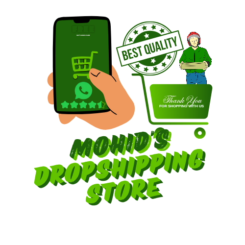

# MDS QuicklyYours - Modern E-Commerce Platform

 <!-- Make sure you have a logo.png in an /assets folder -->

**MDS QuicklyYours** is a complete, modern, and feature-rich e-commerce storefront built from the ground up using pure HTML, CSS, and Vanilla JavaScript. This project demonstrates a "serverless" or "Jamstack" approach, leveraging client-side technologies and free-tier services to create a powerful, fast, and scalable online store without traditional backend overhead.

This platform is designed to be a professional, high-performance dropshipping or direct-to-customer store, focusing on a stellar user experience and easy content management.

**Live Demo:** [https://mds-quicklyyour.netlify.app/](https://mds-quicklyyour.netlify.app/) <!-- Replace with your live URL -->

---

## ✨ Key Features

This isn't just a static site. It's a dynamic, single-page-application-style experience with a rich feature set:

#### 🛒 **Advanced Shopping Experience:**
*   **Product Variants:** Products can have multiple features like **Size**, **Color**, and more, with selectable options.
*   **Interactive Cart Sidebar:** A slide-in cart that allows users to manage quantities or remove items without leaving their current page.
*   **Dynamic Checkout:** A dedicated checkout page that calculates totals, delivery charges, and discounts in real-time.
*   **Live Search & Filtering:** Users can instantly search for products by name and filter by category on the main shop page.
*   **Product Videos:** In addition to an image gallery, products can feature embedded YouTube videos for better engagement.

#### 👤 **User-Centric Features:**
*   **"No-Backend" Login System:** A simple, persistent login system using `localStorage` to remember user details (Name, Phone).
*   **Smart Geolocation:** Automatically fetches a user's GPS coordinates and can pre-select their city (e.g., Karachi vs. Other) to calculate delivery fees.
*   **Persistent User Theme:** A sleek Dark/Light mode theme switcher that remembers the user's choice across sessions.

#### ⚙️ **Admin & Content Management:**
*   **Headless Admin Panel:** A secure, password-protected `admin.html` page for full content management.
*   **Full CRUD for Products:** Add, edit, and delete products, including all details like name, price, description, and images.
*   **Variant Management:** The admin panel allows for the creation and editing of product features and their options (e.g., adding a new "Material" feature with options like "Cotton" or "Polyester").
*   **Direct Cloudinary Integration:** Upload images directly from the admin panel to a Cloudinary account, with instant previewing.
*   **"Save & Download" System:** A clever workflow that allows the admin to download an updated `data.js` file, which can then be committed to Git to update the live site.

#### 📲 **Order Fulfillment:**
*   **WhatsApp Order Integration:** Finalizes orders by opening WhatsApp with a pre-filled, detailed message containing all customer and order information.
*   **Silent Email Notifications:** A redundant, background notification system (using Formspree/EmailJS) sends a detailed order confirmation email to the store owner without interrupting the customer's flow.

---

## 🛠️ Tech Stack & Architecture

This project proudly uses a modern, client-side-heavy architecture:

*   **Frontend:** HTML5, CSS3, Vanilla JavaScript (ES6+)
*   **Styling:**
    *   Pure CSS with Variables (for Theming)
    *   Responsive Design using Flexbox & Grid
    *   Internal CSS for component-specific styling (`product.html`, `admin.html`)
*   **Animations:** [**GSAP (GreenSock Animation Platform)**](https://greensock.com/gsap/) for high-performance, professional animations and scroll-triggered effects.
*   **Database:** A simple but effective `data.js` file acts as a JSON-based database, making the site incredibly fast to load and easy to deploy.
*   **Image & Video Hosting:** [**Cloudinary**](https://cloudinary.com/) for optimized, transformed, and globally delivered media. Videos are embedded from YouTube.
*   **Deployment:** Statically hosted on [**Netlify**](https://www.netlify.com/), taking full advantage of their CDN and performance features.
*   **Icons:** [Boxicons](https://boxicons.com/)

---

## 🚀 Getting Started

To run this project locally, follow these simple steps:

1.  **Clone the repository:**
    ```bash
    git clone https://github.com/your-username/your-repo-name.git
    ```

2.  **Navigate to the project directory:**
    ```bash
    cd your-repo-name
    ```

3.  **Run a local server:**
    Since this project uses JavaScript modules and fetch requests, you cannot simply open `index.html` in your browser. You need a local server. The easiest way is using the [Live Server](https://marketplace.visualstudio.com/items?itemName=ritwickdey.LiveServer) extension for VS Code.
    *   Right-click on `index.html`.
    *   Select "Open with Live Server".

---

## 🔧 Configuration

To use the full functionality (especially the admin panel), you'll need to configure a few things:

1.  **Admin Panel (`/js/admin.js`):**
    *   Set your `ADMIN_PASSWORD`.
    *   Enter your `CLOUDINARY_CLOUD_NAME` and `CLOUDINARY_UPLOAD_PRESET` from your Cloudinary account.

2.  **Order Notifications:**
    *   **WhatsApp:** In `/js/app.js`, update the `yourWhatsAppNumber` variable in the `handlePlaceOrder` function.
    *   **Email (Optional):** If using a service like Formspree, update the `formspreeEndpoint` URL in the same function.

---

## 📝 Admin Panel Workflow

Managing the store content is designed to be simple and Git-based:

1.  Navigate to `/admin.html` and log in.
2.  Make all your changes: add new products, edit variants, upload images, etc.
3.  When you are done, click the **"Save & Download Data File"** button.
4.  This will download a new `data.js` file.
5.  Replace the old `data.js` file in your `/js` project folder with this new one.
6.  Commit the change and push it to GitHub. Netlify (or your host) will automatically deploy the updated site.

This workflow provides the power of a CMS without the complexity or cost of a database and backend server.
